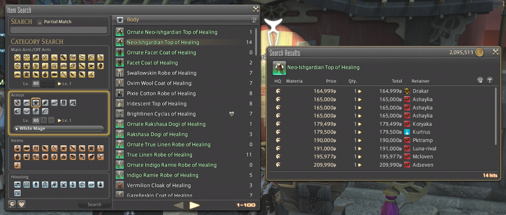
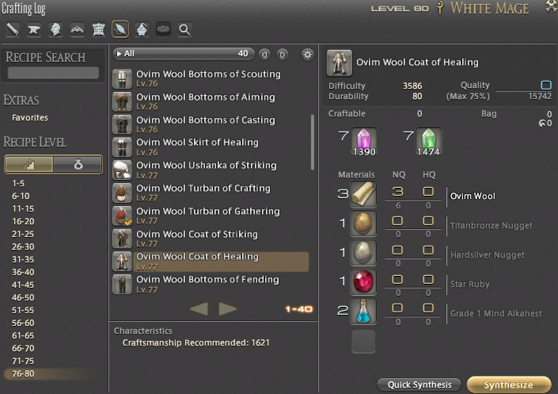

# ffxivcrafting

## What it is

[Final Fantasy XIV](https://na.finalfantasyxiv.com/lodestone/) is an MMORPG with a market board and crafting system. A market board allows for selling items in the in-game currency (gil):

The game also includes 8 crafter classes, each with different recipes they can make at different levels. Some people will level up all of their crafters to max rank, which is known as becoming an "omnicrafter." Here is an example crafting recipe:

If you're a lazy omnicrafter, can you make a profit simply from buying raw materials and reselling the crafted version of those materials? The answer is yes. To figure this out, I represented the crafting list for each item as a tree, and used [depth-first search](https://en.wikipedia.org/wiki/Depth-first_search) to compute the gil cost to buy raw materials and craft vs. directly buying it from the market board. You can see this on the output example below:

    Item name? whisperfine woolen coat
    1 whisperfine woolen coat (519429/630000, lvl 70*** wvr craft)
      ╚═ 1 sewing thread (563/5000, lvl 60** wvr craft)
        ╚═ 3 whitefrost cotton boll (150, lvl 60 btn @ normal  coerthas western highlands [11.0, 15.6])
        ╚═ 7 wind crystal (224, lvl 30 btn @ normal  central shroud [24.5, 31.0])
        ╚═ 7 lightning crystal (189, lvl 30 btn @ normal  central thanalan [24.6, 31.0])
      ╚═ 2 steppe serge (3000/3000, lvl 66 wvr craft)
        ╚═ 6 worsted yarn (2946/18000, lvl 66 wvr craft)
          ╚═ 6 natron (3240/8100, lvl 25 alc craft)
            ╚═ 6 rock salt (444, lvl 15 min @ normal  central thanalan [14.7, 22.5])
            ╚═ 6 effervescent water (1800, lvl 25 min @ normal  south shroud [16.0, 19.5])
            ╚═ 12 water shard (996, lvl 30 btn @ normal  eastern la noscea [28.0, 33.0])
          ╚═ 12 manzasiri hair (2400, [kill] manzasiri @ the azim steppe [17.0, 33.0])
          ╚═ 12 halgai mane (2880, [kill] halgai @ the azim steppe [19.0, 16.0])
          ╚═ 12 lightning crystal (324, lvl 30 btn @ normal  central thanalan [24.6, 31.0])
        ╚═ 6 lightning crystal (162, lvl 30 btn @ normal  central thanalan [24.6, 31.0])
      ╚═ 2 ground sloth leather (5830/14000, lvl 70*** ltw craft)
        ╚═ 4 thavnairian alumen (1540, 10 allagan tomestones)
        ╚═ 8 ground sloth pelt (9600, 10 allagan tomestones)
        ╚═ 4 wind cluster (40, lvl 50 btn @ unspoiled 1 AM, 5 AM, 9 AM mor dhona [32.0, 14.4])
        ╚═ 4 earth cluster (480, lvl 50 btn @ unspoiled 1/5/9 AM mor dhona [32.0, 14.4])
      ╚═ 2 whisperfine fleece (510000, [kill] duty reward @ lost canals of uznair (lvl 70 map) [0.0, 0.0])
      ╚═ 2 wind cluster (20, lvl 50 btn @ unspoiled 1 AM, 5 AM, 9 AM mor dhona [32.0, 14.4])
      ╚═ 2 lightning cluster (16, lvl 50 btn @ unspoiled 1 AM, 5AM, 9AM mor dhona [32, 11])

From this we can conclude that the cost to make the whisperfine woolen coat is actually 519429 gil, which means if you can resell it at 630000 gil, you make about 100k gil in profit. Enough metadata is provided that you might be able to reduce this number further by gathering ground sloth leather yourself, which would make you another 14k in profit.

## Why it exists

There are tools that already exist that roughly give this information, including the excellent [Garland Tools database](https://garlandtools.org/db/) and the [Gamerescape wiki](https://ffxiv.gamerescape.com/wiki/Whisperfine_Woolen_Coat), but they do not show the whole tree at once, or they do not compute gil costs. This provides additional information that is missing from those tools.

## How do I use it?

Run `python menu.py` in the root directory. You are presented with these options:

    1. Look up an item's cost tree
    2. Enter an item's info
    3. Update an item's prices recursively
    4. Run a diagnostic for bad inputs
    0. Quit

1. is the option shown in the sample output above.
2. allows for new information to be entered.
3. allows for recomputation of a particular item's tree cost. This means a bunch of manual price entry.
4. allows for certain types of spelling errors to be caught, since these will lead to an incomplete tree.

## Technical details

### Input valiation

Making this software useful required a lot of manual data entry. Manual data entry is prone to error, which could mess up the tree calculations. Therefore, I added a tool that allows for formal specification of allowed inputs using regex. It works as a replacement for the standard Python3 library `input()` function. The function is defined as follows:

    def validate_input(prompt, validf, message=''):
        # prompt: how to ask for the the input
        # validf may either be an iterable or function
        # message: what to return if validation fails. if empty and list, return valid string list.
        if callable(validf):
            validtype = 1
        elif hasattr(validf, '__iter__'):
            validtype = 0
        else:
            raise Exception(('Unrecognized object to validate with:', validf))
    
        currinput = input(prompt + ' ')
        if validtype == 0:
            while currinput not in validf:
                if message:
                    print(message)
                else:
                    print('    Invalid input. String must be a member of:', validf)
                currinput = input(prompt + ' ')
        if validtype == 1:
            while not validf(currinput):
                if message:
                    print(message)
                else:
                    print('    Invalid input.')
                currinput = input(prompt + ' ')
        return currinput

An example function input to validate_input is this coordinate validator function (which accepts inputs like (0, 2.6)):

    def coord_validator(string):
        import re
    
        findnums = re.compile(r'(\d+(\.\d)?\s*,\s*\d+(\.\d)?)')
        matches = re.findall(findnums, string)
        if matches:
            return True
        else:
            return False

## Future development

While items.json is already fairly expansive from all the manual data entry, it would be nice to automatically gather the rest. This would be done by scraping data from Garland Tools or Gamerescape. Given my previous proficiencies, I would probably use selenium for this.

You may also notice a few unused files.

1. makers.json is for a future expansion to support non-omnicrafters. If the skill required to make a particular craft is above the current levels listed in that file, it will mark that line in the output with a red line and force the gil cost of that item to be the market board price. This allows people to still check the tree regardless of the their current level.

2. inventory.json could be used to replace items in the tree with 0 cost (since you already have those items). However, manually entering your inventory and updating it sounds painful, so this would need more development work before becoming a bigger convenience than burden.
